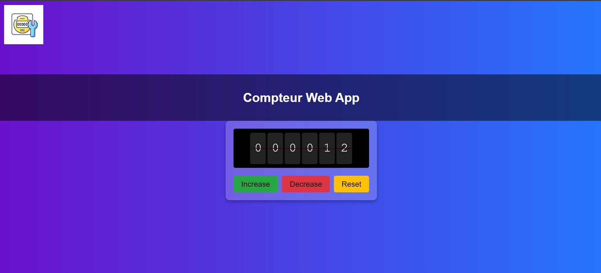
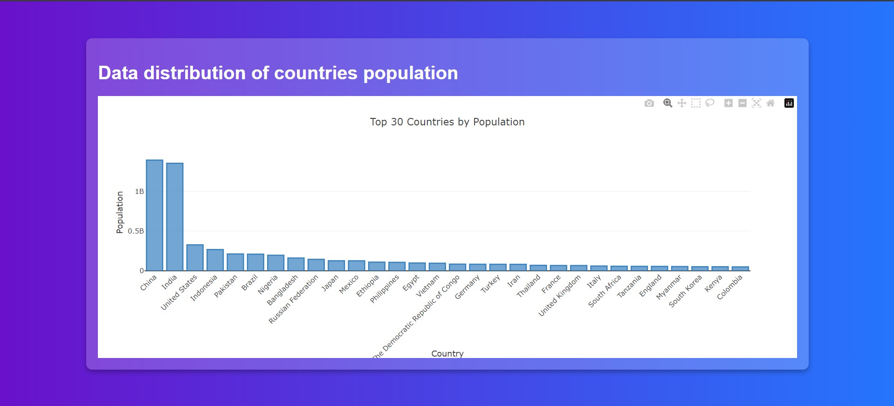

# Examen_data_visualisation
Rendu de mon partiel de data visualisation

### Premier exercice
J'ai implémenté une fonction permettant de renvoyer les indice d'une liste de nombre pour lesquels en les additionnant nous trouvons la valeur cible (target).
J'ai laissé des exemples que nous pouvons visualiser en lancant "node main.js".

### Deuxième exercice
J'ai tout simplement réalisé un compteur permettant d'ajouter ou de retirer un et de le remettre à zéro.

### Troisième exercice
J'ai réalisé un graphique permettant de visualisé la répartition des données sur la population des pays.

